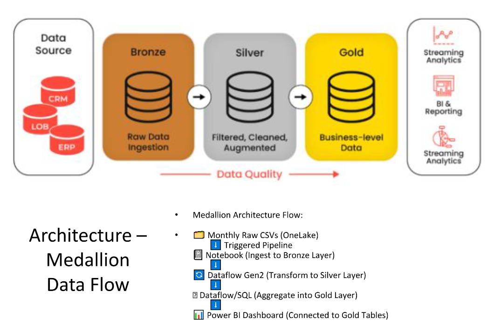
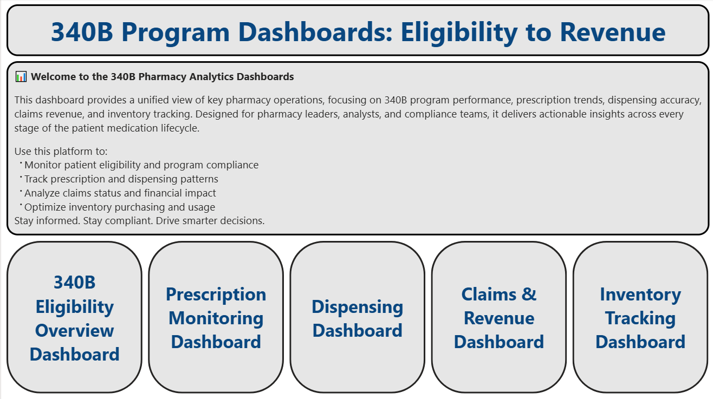
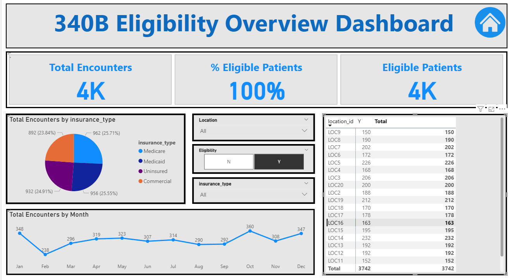
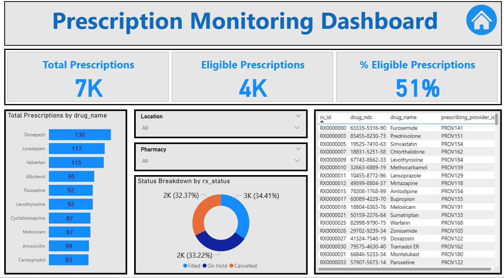
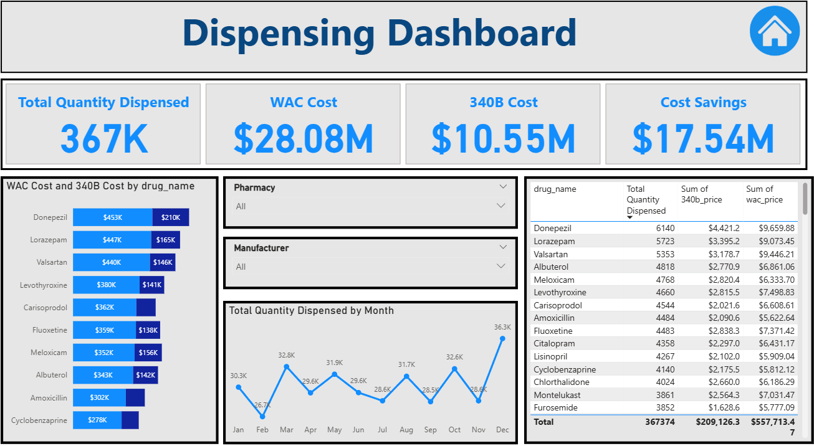
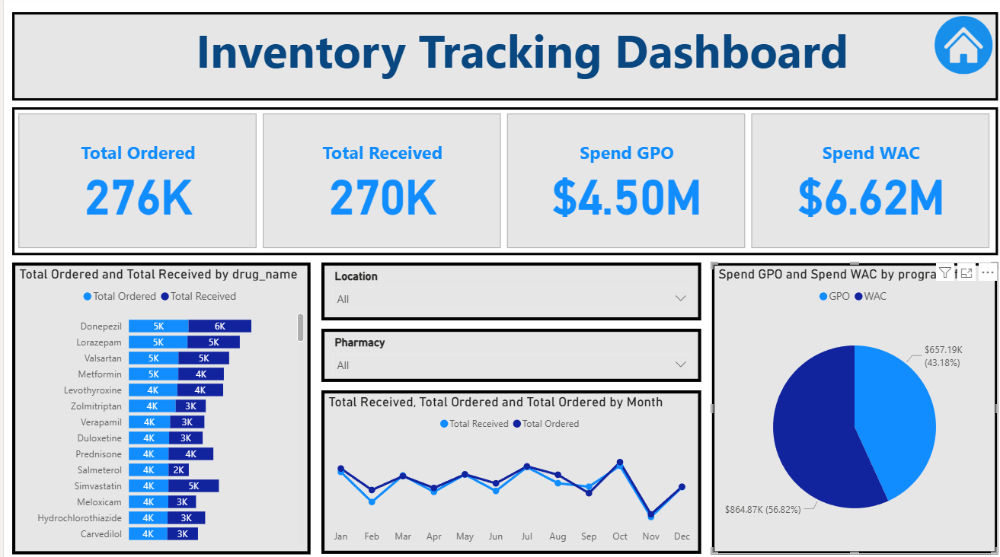

# 🏥 340B Data Integration & Analytics Pipeline – Microsoft Fabric

This project showcases a fully automated data engineering pipeline for processing **340B pharmacy data** using **Microsoft Fabric**. It applies the **Medallion Architecture (Bronze → Silver → Gold)** and provides **real-time Power BI dashboards** to support pharmacy leadership, compliance, and operations teams.

---

## ⚠️ Data Privacy Note

🧪 **All data in this project is synthetically generated using Python libraries (`faker`, `pandas`)**.  
There is **no real patient, provider, or claims data** used — making it safe for public use and fully reproducible.

---

## 🧰 Tools & Technologies

- **Microsoft Fabric**: Lakehouse, Pipelines, Dataflow Gen2
- **PySpark Notebooks**: Bronze layer ingestion
- **Dataflow Gen2**: Silver and Gold layer transformations
- **Power BI**: Dashboards and KPIs
- **Python**: Data simulation using `faker`, `pandas`

---

## 🧱 Architecture Overview

```plaintext
1. OneLake (Monthly CSVs dropped)
2. PySpark Notebook (Bronze Layer: Ingest raw files)
3. Dataflow Gen2 (Silver Layer: Clean, Deduplicate, Join)
4. Dataflow Gen2 (Gold Layer: Star Schema Fact/Dim Modeling)
5. Power BI (Dashboards for analytics and reporting)
```

### 📌 Visual Overview



---

## 📁 Repository Structure

```
/
├── README.md
├── 340B_Fabric_Project_Asad_Patel.pdf
│
├── data/
│   ├── May_2025_Claims.csv
│   ├── May_2025_dispensing.csv
│   ├── May_2025_inventory.csv
│   ├── May_2025_patient_eligibility.csv
│   ├── May_2025_prescriptions.csv
│   ├── drug_catalog.csv
│
├── notebooks/
│   ├── bronze_ingestion.ipynb
│   ├── bronze_notebook_code.png
│   └── bronze_table_preview.png
│
├── dataflows/
│   ├── silver_dataflow_overview.png
│   ├── gold_dataflow_star_schema.png
│
├── dashboards/
│   ├── dashboard_homepage.png
│   ├── eligibility_dashboard.png
│   ├── prescriptions_dashboard.png
│   ├── dispensing_kpis.png
│   └── inventory_tracking_view.png
│
├── pipeline_trigger/
│   ├── pipeline_trigger_settings.png
│   └── pipeline_flow_steps.png
│
├── assets/
│   ├── medallion_architecture_diagram.png

```

---

## 🧪 Synthetic Data Generation

Run the script below to generate the fake datasets used in this project:

```bash
cd data
python data_generator.py
```

This creates synthetic CSVs:

- `eligibility.csv`
- `prescriptions.csv`
- `dispensing.csv`
- `claims.csv`
- `inventory.csv`
- `provider_roster.csv`

Each file contains hundreds of rows simulating real-world hospital pharmacy data.

---

## 📊 Power BI Dashboards

<table>
  <tr>
    <td></td>
    <td></td>
  </tr>
  <tr>
    <td align="center"><b>Home Page</b></td>
    <td align="center"><b>Eligibility Monitoring</b></td>
  </tr>
</table>

<br/>

<table>
  <tr>
    <td></td>
    <td></td>
  </tr>
  <tr>
    <td align="center"><b>Prescription Oversight</b></td>
    <td align="center"><b>Dispensing KPIs</b></td>
  </tr>
</table>

<br/>

<p align="center">
  <br/>
  <b>Inventory Tracking</b>
</p>

---

## ✅ Business Impact

- ⛔ **Eliminated manual data entry**
- 🔄 **Fully automated monthly data processing pipeline**
- 📊 **Real-time insights across pharmacy operational domains**
- ⚙️ **Modular & scalable design adaptable to other hospital data workflows**

---

## 🔗 Connect With Me

- 📧 Email: [asadpatel517@gmail.com](mailto:asadpatel517@gmail.com)  
- 💼 LinkedIn: [https://linkedin.com/in/asad--patel](https://linkedin.com/in/asad--patel)  
- 💻 GitHub: [https://github.com/apatel517](https://github.com/apatel517)

---

## 📄 View Full Project Documentation

👉 **[Click here to view the complete PDF](./340B-Fabric-Project/340B_Fabric_Portfolio_AsadPatel_Final07.26.pdf)**  
